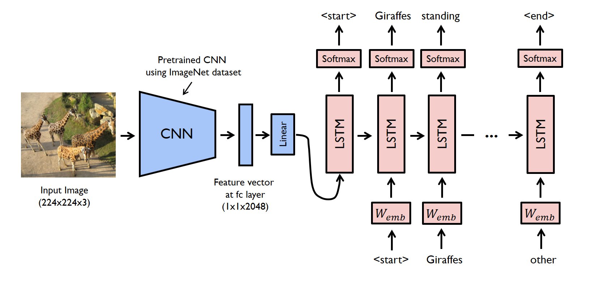

### Image Captioning using CNN-RNN Architecture

(

The CNN-RNN framework for image captioning comprises two primary components: the CNN-based encoder and the RNN-based decoder.

##### CNN Encoder:
The CNN encoder extracts features from the input image, which are then flattened. These flattened features are passed through an embedding layer to obtain embedded representations. These embedded features serve as the input for the decoder.

##### RNN Decoder:
The RNN decoder takes the output of the CNN encoder as its input. It generates a sequence of words describing the image using a recurrent neural network, such as a Long Short-Term Memory (LSTM) network or a Gated Recurrent Unit (GRU). The decoder is trained to predict the next word in the sequence based on the previous words.

##### This implementation has been tested with Python 3.12 and PyTorch

### Dataset:
To train the CNN-RNN model for image captioning, a dataset containing images and their corresponding captions is required.

## Credits

This repository incorporates code from the following source:

Original Repository:

(https://github.com/iamirmasoud/image_captioning)

